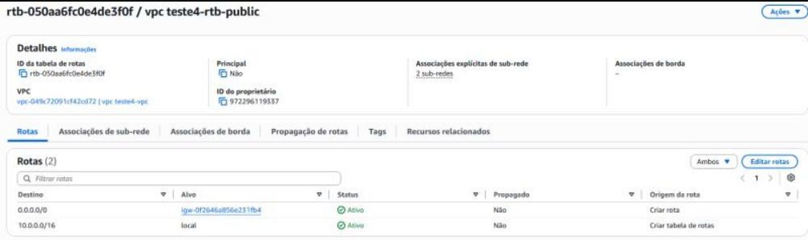
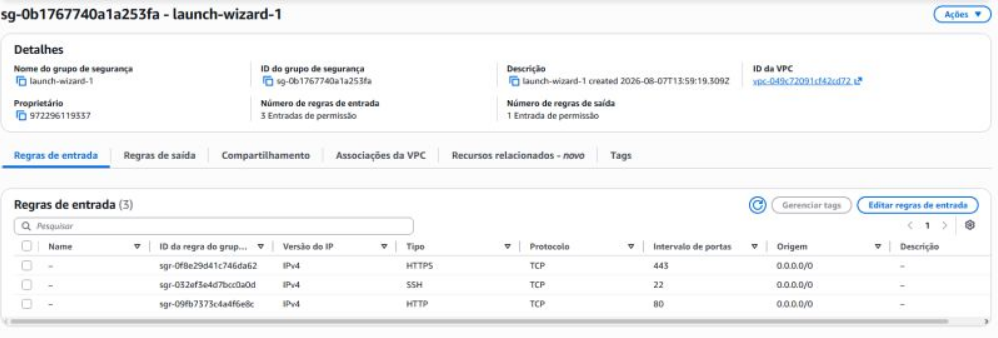
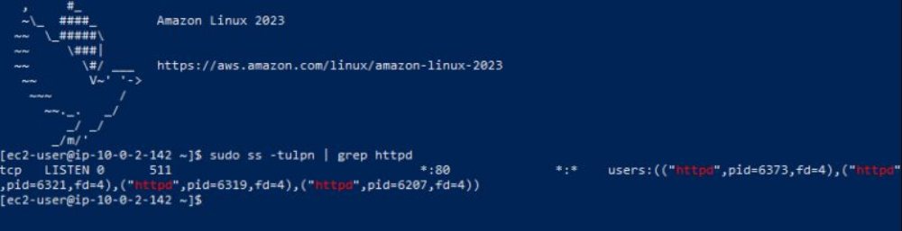
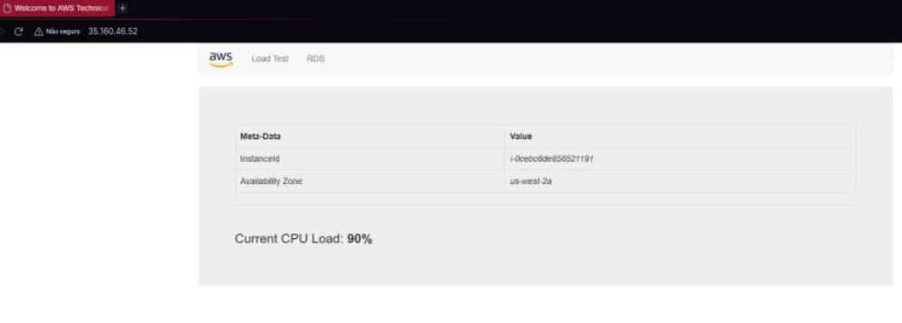

# Laboratório: Arquitetura de Rede AWS VPC, EC2 e Apache com a Escola da Nuvem

Laboratório guiado durante o curso Fundamentos de Computação em Nuvem AWS re/Start da Escola da Nuvem, com o objetivo de montar uma arquitetura de rede básica na AWS e subir um servidor web funcional dentro dela.

## Objetivo

Praticar os conceitos centrais de rede em nuvem, segmentação de subredes, controle de tráfego por Security Groups e provisionamento de instâncias, construindo o ambiente que sustenta uma aplicação web simples.

## Arquitetura da VPC

| Recurso | Configuração |
| :--- | :--- |
| VPC CIDR IPv4 | 10.0.0.0/16 |
| Public Subnet 1 | 10.0.0.0/24 |
| Private Subnet 1 | 10.0.1.0/24 |
| Public Subnet 2 | 10.0.2.0/24 |
| Private Subnet 2 | 10.0.3.0/24 |
| Availability Zones | 2 |
| NAT Gateway | 1 em uma AZ |
| VPC Endpoints | Nenhum |
| Tenancy | Default |

## O que foi construído

### 1. Criação da VPC e Tabela de Rotas
VPC 10.0.0.0/16 criada com quatro subredes, sendo duas públicas e duas privadas, distribuídas em duas Zonas de Disponibilidade. A estrutura isola os componentes expostos daqueles de uso interno.

Configuração da tabela de rotas pública encaminhando o tráfego externo 0.0.0.0/0 para o Internet Gateway IGW.

### 2. Configuração de Security Groups
Regras de firewall aplicadas na instância para controle de acesso stateful, liberando explicitamente as portas SSH 22, HTTP 80 e HTTPS 443.

Regras de entrada configuradas no Security Group para permitir acesso remoto e tráfego web.

### 3. Instalação e Configuração do Apache via SSH
Provisionamento de uma instância t3.micro com Amazon Linux 2023 em subrede pública, acesso remoto via SSH e inicialização do servidor web Apache.

Verificação via comando ss -tulpn no terminal confirmando o serviço httpd ativo e escutando na porta 80.

### 4. Validação da Aplicação Web

Aplicação acessada via endereço IP público no navegador, confirmando a conectividade de rede e a resposta do servidor.

## Conceitos praticados

* Planejamento de CIDR e segmentação de rede pública e privada como base de arquitetura segura.
* Múltiplas Availability Zones como fundamento para resiliência e alta disponibilidade.
* Security Groups como controle de tráfego stateful na borda da instância.
* Administração remota via SSH para gerenciamento de servidores Linux.
* Integração entre tabela de rotas, firewall e serviço web exposto.

## Observação sobre este writeup

As regras de entrada do Security Group no ambiente de testes foram mantidas abertas para 0.0.0.0/0 para viabilizar o exercício. Em ambientes de produção, a boa prática exige restringir a porta SSH 22 exclusivamente ao IP de gerenciamento.

Laboratório realizado na Escola da Nuvem, trilha AWS re/Start.
